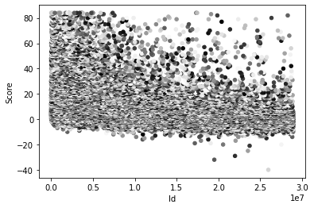
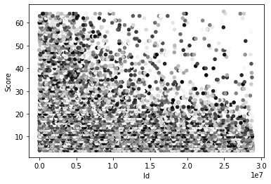
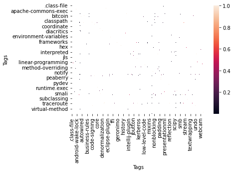

# Tag Recommendation for Stackoverflow Questions
a matrix of tags is created and filled by Confidence(Tag1, Tag2) which is used to measure similarity and closeness of two tags. [Confidence](https://en.wikipedia.org/wiki/Association_rule_learning#Confidence) is a type of association rule for calculating closeness of items in a dataset. Confidence is the percentage of all transactions satisfying X that also satisfy Y.                      


```python
import pandas as pd
import numpy as np
from tqdm import tqdm
import seaborn as sns
```


```python
# reading tags
tags_raw: pd.DataFrame = pd.read_csv('tags.csv', sep='\t')
tags_agg: pd.DataFrame = tags_raw.groupby('Id').agg(lambda x: x.tolist())

# reading questions
questions_raw: pd.DataFrame = pd.read_csv('Questions.csv', sep=',', encoding='utf-16').drop(['CreationDate','ClosedDate'], axis=1).sort_values(by='Score')
```


```python
# filter input data and return question frame and tags that are in the questions
def filter_data(score_limit: int=0, comment_limit: int=0)-> (pd.DataFrame, pd.Series):
    # filter questions base on score and comment's count
    questions_filtered: pd.DataFrame = questions_raw[questions_raw['Score'] > score_limit]
    questions_filtered = questions_filtered[questions_filtered['CommentCount'] > comment_limit]
    # add tags list to the questions
    questions_result: pd.DataFrame = questions_filtered.merge(tags_agg, left_on='Id', right_on='Id', how='inner')
    # calculate list of unique tags included in the questions
    tags_result: pd.Series = questions_result.Tags.explode(ignore_index=True).drop_duplicates()
    return questions_result, tags_result

# return index of questions including all the input tags
def index_all_tags(tag_list)-> pd.Series:
    return ~questions.Tags.apply(lambda y: any(set(tag_list) - set(y)) )

# what is the probability of tag2 being in the same set of tag1
def calculate_tag_confidence(tag1: str, tag2: str)-> float:
    tags_join = index_all_tags([tag1, tag2]).value_counts()
    # zero count if no True is present otherwise count is equal to number of Trues.
    join_count = 0 if len(tags_join) < 2 else tags_join[1]
    tags_tag1 = index_all_tags([tag1]).value_counts()
    tag1_count = 0 if len(tags_tag1) < 2 else tags_tag1[1]
    return join_count / tag1_count

# set confidence for column of input tag.
def set_confidence(df: pd.DataFrame, tag: str):
    # calculate for tags that have minimum one intersect with input tag
    for i in questions[index_all_tags([tag])].Tags.explode(ignore_index=True).drop_duplicates():
        df[tag][i] = calculate_tag_confidence(tag, i)

# calculate distance between two tags
def calculate_distance(tag1: str, tag2: str) -> float:
    return 1 - calculate_tag_confidence(tag1, tag2)
```


```python
# getting base questions and tags
questions, tags = filter_data(score_limit=10,comment_limit=0)
```


```python
# matrix oc similarities between every pair of tags. initial value is NaN.
similarity_table: pd.DataFrame = pd.crosstab(tags,tags, values=[0 for i in range(0,len(tags))], aggfunc=lambda x: 0)

# set confidence for each pair of tags.
for each in tqdm(similarity_table.index):
    set_confidence(similarity_table,each)
```

    100%|██████████| 3647/3647 [39:30<00:00,  1.54it/s]  
    


```python
similarity_table
```


<div>
<style scoped>
    .dataframe tbody tr th:only-of-type {
        vertical-align: middle;
    }

    .dataframe tbody tr th {
        vertical-align: top;
    }

    .dataframe thead th {
        text-align: right;
    }
</style>
<table border="1" class="dataframe">
  <thead>
    <tr style="text-align: right;">
      <th>Tags</th>
      <th>.class-file</th>
      <th>.net</th>
      <th>2-3-4-tree</th>
      <th>2d</th>
      <th>2d-games</th>
      <th>32-bit</th>
      <th>32bit-64bit</th>
      <th>3d</th>
      <th>64bit</th>
      <th>7zip</th>
      <th>...</th>
      <th>zero-pad</th>
      <th>zeroconf</th>
      <th>zeromq</th>
      <th>zimbra</th>
      <th>zip</th>
      <th>zipinputstream</th>
      <th>zipoutputstream</th>
      <th>zookeeper</th>
      <th>zoom</th>
      <th>zxing</th>
    </tr>
    <tr>
      <th>Tags</th>
      <th></th>
      <th></th>
      <th></th>
      <th></th>
      <th></th>
      <th></th>
      <th></th>
      <th></th>
      <th></th>
      <th></th>
      <th></th>
      <th></th>
      <th></th>
      <th></th>
      <th></th>
      <th></th>
      <th></th>
      <th></th>
      <th></th>
      <th></th>
      <th></th>
    </tr>
  </thead>
  <tbody>
    <tr>
      <th>.class-file</th>
      <td>1.0</td>
      <td>NaN</td>
      <td>NaN</td>
      <td>NaN</td>
      <td>NaN</td>
      <td>NaN</td>
      <td>NaN</td>
      <td>NaN</td>
      <td>NaN</td>
      <td>NaN</td>
      <td>...</td>
      <td>NaN</td>
      <td>NaN</td>
      <td>NaN</td>
      <td>NaN</td>
      <td>NaN</td>
      <td>NaN</td>
      <td>NaN</td>
      <td>NaN</td>
      <td>NaN</td>
      <td>NaN</td>
    </tr>
    <tr>
      <th>.net</th>
      <td>NaN</td>
      <td>1.0</td>
      <td>NaN</td>
      <td>NaN</td>
      <td>NaN</td>
      <td>NaN</td>
      <td>NaN</td>
      <td>NaN</td>
      <td>NaN</td>
      <td>NaN</td>
      <td>...</td>
      <td>NaN</td>
      <td>NaN</td>
      <td>NaN</td>
      <td>NaN</td>
      <td>NaN</td>
      <td>NaN</td>
      <td>NaN</td>
      <td>NaN</td>
      <td>NaN</td>
      <td>NaN</td>
    </tr>
    <tr>
      <th>2-3-4-tree</th>
      <td>NaN</td>
      <td>NaN</td>
      <td>1.0</td>
      <td>NaN</td>
      <td>NaN</td>
      <td>NaN</td>
      <td>NaN</td>
      <td>NaN</td>
      <td>NaN</td>
      <td>NaN</td>
      <td>...</td>
      <td>NaN</td>
      <td>NaN</td>
      <td>NaN</td>
      <td>NaN</td>
      <td>NaN</td>
      <td>NaN</td>
      <td>NaN</td>
      <td>NaN</td>
      <td>NaN</td>
      <td>NaN</td>
    </tr>
    <tr>
      <th>2d</th>
      <td>NaN</td>
      <td>NaN</td>
      <td>NaN</td>
      <td>1.0</td>
      <td>1.0</td>
      <td>NaN</td>
      <td>NaN</td>
      <td>NaN</td>
      <td>NaN</td>
      <td>NaN</td>
      <td>...</td>
      <td>NaN</td>
      <td>NaN</td>
      <td>NaN</td>
      <td>NaN</td>
      <td>NaN</td>
      <td>NaN</td>
      <td>NaN</td>
      <td>NaN</td>
      <td>NaN</td>
      <td>NaN</td>
    </tr>
    <tr>
      <th>2d-games</th>
      <td>NaN</td>
      <td>NaN</td>
      <td>NaN</td>
      <td>0.2</td>
      <td>1.0</td>
      <td>NaN</td>
      <td>NaN</td>
      <td>NaN</td>
      <td>NaN</td>
      <td>NaN</td>
      <td>...</td>
      <td>NaN</td>
      <td>NaN</td>
      <td>NaN</td>
      <td>NaN</td>
      <td>NaN</td>
      <td>NaN</td>
      <td>NaN</td>
      <td>NaN</td>
      <td>NaN</td>
      <td>NaN</td>
    </tr>
    <tr>
      <th>...</th>
      <td>...</td>
      <td>...</td>
      <td>...</td>
      <td>...</td>
      <td>...</td>
      <td>...</td>
      <td>...</td>
      <td>...</td>
      <td>...</td>
      <td>...</td>
      <td>...</td>
      <td>...</td>
      <td>...</td>
      <td>...</td>
      <td>...</td>
      <td>...</td>
      <td>...</td>
      <td>...</td>
      <td>...</td>
      <td>...</td>
      <td>...</td>
    </tr>
    <tr>
      <th>zipinputstream</th>
      <td>NaN</td>
      <td>NaN</td>
      <td>NaN</td>
      <td>NaN</td>
      <td>NaN</td>
      <td>NaN</td>
      <td>NaN</td>
      <td>NaN</td>
      <td>NaN</td>
      <td>NaN</td>
      <td>...</td>
      <td>NaN</td>
      <td>NaN</td>
      <td>NaN</td>
      <td>NaN</td>
      <td>NaN</td>
      <td>1.0</td>
      <td>1.0</td>
      <td>NaN</td>
      <td>NaN</td>
      <td>NaN</td>
    </tr>
    <tr>
      <th>zipoutputstream</th>
      <td>NaN</td>
      <td>NaN</td>
      <td>NaN</td>
      <td>NaN</td>
      <td>NaN</td>
      <td>NaN</td>
      <td>NaN</td>
      <td>NaN</td>
      <td>NaN</td>
      <td>NaN</td>
      <td>...</td>
      <td>NaN</td>
      <td>NaN</td>
      <td>NaN</td>
      <td>NaN</td>
      <td>NaN</td>
      <td>0.5</td>
      <td>1.0</td>
      <td>NaN</td>
      <td>NaN</td>
      <td>NaN</td>
    </tr>
    <tr>
      <th>zookeeper</th>
      <td>NaN</td>
      <td>NaN</td>
      <td>NaN</td>
      <td>NaN</td>
      <td>NaN</td>
      <td>NaN</td>
      <td>NaN</td>
      <td>NaN</td>
      <td>NaN</td>
      <td>NaN</td>
      <td>...</td>
      <td>NaN</td>
      <td>NaN</td>
      <td>NaN</td>
      <td>NaN</td>
      <td>NaN</td>
      <td>NaN</td>
      <td>NaN</td>
      <td>1.0</td>
      <td>NaN</td>
      <td>NaN</td>
    </tr>
    <tr>
      <th>zoom</th>
      <td>NaN</td>
      <td>NaN</td>
      <td>NaN</td>
      <td>NaN</td>
      <td>NaN</td>
      <td>NaN</td>
      <td>NaN</td>
      <td>NaN</td>
      <td>NaN</td>
      <td>NaN</td>
      <td>...</td>
      <td>NaN</td>
      <td>NaN</td>
      <td>NaN</td>
      <td>NaN</td>
      <td>NaN</td>
      <td>NaN</td>
      <td>NaN</td>
      <td>NaN</td>
      <td>1.0</td>
      <td>NaN</td>
    </tr>
    <tr>
      <th>zxing</th>
      <td>NaN</td>
      <td>NaN</td>
      <td>NaN</td>
      <td>NaN</td>
      <td>NaN</td>
      <td>NaN</td>
      <td>NaN</td>
      <td>NaN</td>
      <td>NaN</td>
      <td>NaN</td>
      <td>...</td>
      <td>NaN</td>
      <td>NaN</td>
      <td>NaN</td>
      <td>NaN</td>
      <td>NaN</td>
      <td>NaN</td>
      <td>NaN</td>
      <td>NaN</td>
      <td>NaN</td>
      <td>1.0</td>
    </tr>
  </tbody>
</table>
<p>3647 rows × 3647 columns</p>
</div>


```python
# show Score distributions over Id from 0 to N-1000's question.
# questions are sorted
colors = np.random.rand(len(questions_raw)-1000)
questions_raw[0:-1000].plot.scatter(x='Id',y='Score',c=colors)
```


    <AxesSubplot:xlabel='Id', ylabel='Score'>


    

    


```python
# same as previous one but on filtered questions
colors = np.random.rand(len(questions)-1000)
questions[0:-1000].plot.scatter(x='Id',y='Score',c=colors)
```


    <AxesSubplot:xlabel='Id', ylabel='Score'>


    

    


```python
# heatmap of similarity table
sns.heatmap(similarity_table)
```


    <AxesSubplot:xlabel='Tags', ylabel='Tags'>


    

    


```python
# calculate top 10 similar tags for intellij-idea
similarity_table.nlargest(10,columns='intellij-idea')['intellij-idea']
```


    Tags
    intellij-idea     1.000000
    android           0.134831
    eclipse           0.134831
    ide               0.112360
    android-studio    0.078652
    junit             0.056180
    osx               0.044944
    gradle            0.033708
    refactoring       0.033708
    annotations       0.022472
    Name: intellij-idea, dtype: float64


```python
# calculate top 10 similar tags for jax-rs
similarity_table.nlargest(10,columns='jax-rs')['jax-rs']
```


    Tags
    jax-rs          1.00000
    jersey          0.37500
    rest            0.37500
    java-ee         0.12500
    resteasy        0.12500
    junit           0.09375
    jax-ws          0.06250
    jaxb            0.06250
    servlets        0.06250
    unit-testing    0.06250
    Name: jax-rs, dtype: float64


```python
# calculate top 10 similar tags for user-interface
similarity_table.nlargest(10,columns='user-interface')['user-interface']
```


    Tags
    user-interface    1.000000
    swing             0.587302
    awt               0.079365
    swt               0.079365
    android           0.063492
    jframe            0.063492
    jbutton           0.047619
    windows           0.047619
    c#                0.031746
    c++               0.031746
    Name: user-interface, dtype: float64


```python
# calculate distance

print(f'regex static -> {calculate_distance("regex","static")}')
print(f'session spring -> {calculate_distance("session","spring")}')
print(f'nullpointerexception dependency-injection -> {calculate_distance("nullpointerexception","dependency-injection")}')
```

    regex static -> 0.9997425334706488
    session spring -> 0.8764302059496567
    nullpointerexception dependency-injection -> 0.9981185324553151
    


```python
#find all top tags
# initial list
tops: pd.DataFrame = pd.DataFrame({'tags': [], 'similarity': []},columns=['tags','similarity'])

for tag in tqdm(similarity_table.index):
    # get top 2 tags in each column
    each = similarity_table.sort_values(by=tag, ascending=False)[tag].head(2)
    # add tags and similarity's probability to list
    tops =tops.append(pd.DataFrame({'tags': [each.index.array], 'similarity': [each.values[1]]}), ignore_index=True)

tops
```

    100%|██████████| 3647/3647 [05:08<00:00, 11.83it/s]
    


<div>
<style scoped>
    .dataframe tbody tr th:only-of-type {
        vertical-align: middle;
    }

    .dataframe tbody tr th {
        vertical-align: top;
    }

    .dataframe thead th {
        text-align: right;
    }
</style>
<table border="1" class="dataframe">
  <thead>
    <tr style="text-align: right;">
      <th></th>
      <th>tags</th>
      <th>similarity</th>
    </tr>
  </thead>
  <tbody>
    <tr>
      <th>0</th>
      <td>[.class-file, bytecode]</td>
      <td>0.500000</td>
    </tr>
    <tr>
      <th>1</th>
      <td>[.net, c#]</td>
      <td>0.362500</td>
    </tr>
    <tr>
      <th>2</th>
      <td>[2-3-4-tree, algorithm]</td>
      <td>1.000000</td>
    </tr>
    <tr>
      <th>3</th>
      <td>[2d, sprite]</td>
      <td>0.400000</td>
    </tr>
    <tr>
      <th>4</th>
      <td>[2d, 2d-games]</td>
      <td>1.000000</td>
    </tr>
    <tr>
      <th>...</th>
      <td>...</td>
      <td>...</td>
    </tr>
    <tr>
      <th>3642</th>
      <td>[zipinputstream, android]</td>
      <td>0.500000</td>
    </tr>
    <tr>
      <th>3643</th>
      <td>[zipinputstream, zipoutputstream]</td>
      <td>1.000000</td>
    </tr>
    <tr>
      <th>3644</th>
      <td>[zookeeper, configuration]</td>
      <td>0.250000</td>
    </tr>
    <tr>
      <th>3645</th>
      <td>[zoom, android]</td>
      <td>0.500000</td>
    </tr>
    <tr>
      <th>3646</th>
      <td>[zxing, barcode]</td>
      <td>0.666667</td>
    </tr>
  </tbody>
</table>
<p>3647 rows × 2 columns</p>
</div>


```python
# sort tops by similarity and return top 10
tops.sort_values(by='similarity',ascending=False).head(10)
```


<div>
<style scoped>
    .dataframe tbody tr th:only-of-type {
        vertical-align: middle;
    }

    .dataframe tbody tr th {
        vertical-align: top;
    }

    .dataframe thead th {
        text-align: right;
    }
</style>
<table border="1" class="dataframe">
  <thead>
    <tr style="text-align: right;">
      <th></th>
      <th>tags</th>
      <th>similarity</th>
    </tr>
  </thead>
  <tbody>
    <tr>
      <th>1119</th>
      <td>[failover, failovercluster]</td>
      <td>1.0</td>
    </tr>
    <tr>
      <th>1435</th>
      <td>[http-chunked, httpurlconnection]</td>
      <td>1.0</td>
    </tr>
    <tr>
      <th>2759</th>
      <td>[rounded-corners, swing]</td>
      <td>1.0</td>
    </tr>
    <tr>
      <th>2761</th>
      <td>[bigdecimal, numerical-analysis]</td>
      <td>1.0</td>
    </tr>
    <tr>
      <th>2763</th>
      <td>[rrd, rrdtool]</td>
      <td>1.0</td>
    </tr>
    <tr>
      <th>1448</th>
      <td>[httpsession, servlets]</td>
      <td>1.0</td>
    </tr>
    <tr>
      <th>1446</th>
      <td>[http, httpresponse]</td>
      <td>1.0</td>
    </tr>
    <tr>
      <th>2764</th>
      <td>[rrd, rrdtool]</td>
      <td>1.0</td>
    </tr>
    <tr>
      <th>2765</th>
      <td>[communication, industrial]</td>
      <td>1.0</td>
    </tr>
    <tr>
      <th>1443</th>
      <td>[http, http-status-codes]</td>
      <td>1.0</td>
    </tr>
  </tbody>
</table>
</div>


